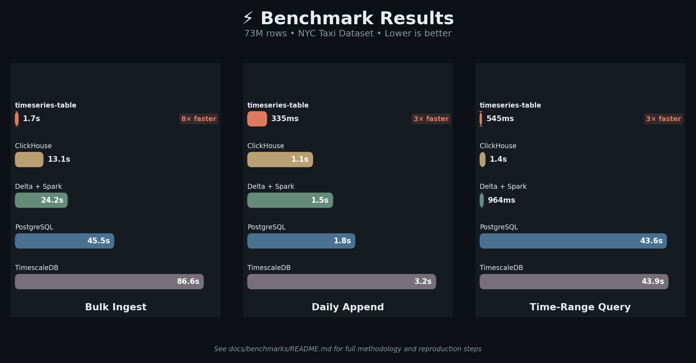
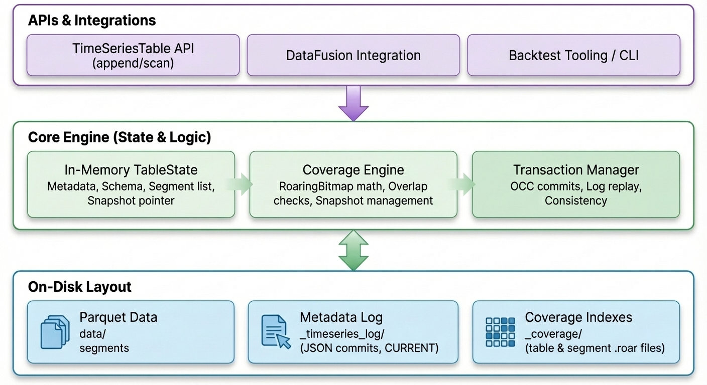

# timeseries-table-format

[](https://www.rust-lang.org)
[](https://crates.io/crates/timeseries-table-format)
[](https://docs.rs/timeseries-table-format)
[](https://pypi.org/project/timeseries-table-format/)
[](https://pypi.org/project/timeseries-table-format/)

[](https://github.com/mag1cfrog/timeseries-table-format/actions/workflows/ci.yml)

<p align="center">
  
</p>

<h3 align="center">
  <strong>Stop managing Parquet files. Start managing time-series tables.</strong>
</h3>

<p align="center">
  A Rust-native table format that brings Delta Lake/Iceberg-style transactions<br/>
  to time-series data—with built-in coverage tracking for gaps and overlaps.
</p>

<p align="center">
  Built in Rust. Python bindings available on PyPI.
</p>

> **Early MVP:** APIs and on-disk layouts may change until v0.1.

---

## Why This Exists

Delta Lake and Apache Iceberg are great for general-purpose analytics. But if you're working with **time-series specifically**, a few problems come up repeatedly—coverage ("do I have data for this range?"), gaps ("where are the missing windows?"), and overlap-safe ingestion ("did I already ingest this time window?"). This project bakes those time-series primitives into the table format.

| Problem | Delta/Iceberg | This Project |
|---------|---------------|--------------|
| "Do I have data for 2024-01-15 to 2024-03-20?" | Scan metadata or query | coverage_ratio_for_range(...) → instant |
| "Where are the gaps in my dataset?" | Write custom logic | max_gap_len_for_range(...) → built-in |
| "Will this append overlap existing data?" | Hope for the best | Automatic overlap detection |
| Deployment complexity | JVM/Spark ecosystem | Single Rust binary |

**This project is ideal for:**
- Backtesting systems that need gap-aware data loading
- Sensor/IoT data pipelines with strict coverage requirements
- Financial data stores where overlap = disaster
- Learning how modern table formats work (well-documented internals!)

---

## Key Features

| | |
|---|---|
| **ACID-like transactions** | Append-only commit log with optimistic concurrency control—no more corrupted datasets from failed writes |
| **Time-first layout** | Timestamp column, entity partitioning, and configurable bucket granularity baked into the format |
| **Coverage tracking** | RoaringBitmap indexes answer "where are my gaps?" in milliseconds, not minutes |
| **Overlap-safe appends** | Automatic detection prevents accidental duplicate data ingestion |
| **DataFusion integration** | SQL queries with time-based segment pruning out of the box |
| **Rust core + Python bindings** | Rust-first core (CLI + libraries) with Python bindings for local workflows |
| **Fast ingest** | [7–27× faster](#performance-benchmarks) than ClickHouse/PostgreSQL on bulk loads and daily appends |

---

## Install (Python)

```bash
pip install timeseries-table-format
```

Python docs: https://mag1cfrog.github.io/timeseries-table-format/

---

## Python Quickstart

**TL;DR:** `Session.sql(...)` returns a `pyarrow.Table`:

```python
import timeseries_table_format as ttf

out = ttf.Session().sql("select 1 as x")
print(type(out))  # pyarrow.Table
```

Convert to Polars: `import polars as pl; pl.from_arrow(out)`

More examples:
- `python/examples/quickstart_create_append_query.py`
- `python/examples/register_and_join_two_tables.py`

<details>
<summary><strong>End-to-end example (create → append → register 2 tables → join)</strong></summary>

```python
from __future__ import annotations

import tempfile
from pathlib import Path

import pyarrow as pa
import pyarrow.parquet as pq

import timeseries_table_format as ttf


def _write_parquet_prices(path: Path) -> None:
    pq.write_table(
        pa.table(
            {
                "ts": pa.array([0, 3_600 * 1_000_000], type=pa.timestamp("us")),
                "symbol": pa.array(["NVDA", "NVDA"], type=pa.string()),
                "close": pa.array([1.0, 2.0], type=pa.float64()),
            }
        ),
        str(path),
    )


def _write_parquet_volumes(path: Path) -> None:
    pq.write_table(
        pa.table(
            {
                "ts": pa.array([0, 3_600 * 1_000_000], type=pa.timestamp("us")),
                "symbol": pa.array(["NVDA", "NVDA"], type=pa.string()),
                "volume": pa.array([10, 20], type=pa.int64()),
            }
        ),
        str(path),
    )


with tempfile.TemporaryDirectory() as d:
    base_dir = Path(d)

    prices_root = base_dir / "prices_tbl"
    prices = ttf.TimeSeriesTable.create(
        table_root=str(prices_root),
        time_column="ts",
        bucket="1h",
        entity_columns=["symbol"],
        timezone=None,
    )
    prices_seg = base_dir / "prices.parquet"
    _write_parquet_prices(prices_seg)
    prices.append_parquet(str(prices_seg))

    volumes_root = base_dir / "volumes_tbl"
    volumes = ttf.TimeSeriesTable.create(
        table_root=str(volumes_root),
        time_column="ts",
        bucket="1h",
        entity_columns=["symbol"],
        timezone=None,
    )
    volumes_seg = base_dir / "volumes.parquet"
    _write_parquet_volumes(volumes_seg)
    volumes.append_parquet(str(volumes_seg))

    sess = ttf.Session()
    sess.register_tstable("prices", str(prices_root))
    sess.register_tstable("volumes", str(volumes_root))

    out = sess.sql(
        """
        select p.ts as ts, p.symbol as symbol, p.close as close, v.volume as volume
        from prices p
        join volumes v
        on p.ts = v.ts and p.symbol = v.symbol
        order by p.ts
        """
    )
    print(type(out))  # pyarrow.Table
    print(out)
```

</details>

---

## Core Concepts

Read this once—these terms show up throughout the project.

**Bucket size (important):** `bucket=1h` does **not** resample your data to “hourly”.

The bucket is the time grid used for **coverage** (“do I have data for this range?”) and **overlap checks** (“did I already ingest this time window?”).

Example: with `bucket=1h`, timestamps `10:05` and `10:55` fall into the same bucket (10:00–11:00). In v0.1, appending two rows for the same entity in the same bucket is treated as **overlap** and will be rejected.

Practical rule: choose a bucket that matches the **granularity you expect to be unique per entity**.
Hourly bars → `1h`, minute bars → `1m`, etc. If you expect multiple rows per entity within an hour, don’t use `1h` in v0.1.

---

## Walkthrough: NVDA 1h + MA(5)

Fastest way to see the format end-to-end (no external services needed):

1) Ingest sample data (creates `examples/nvda_table/`):

```bash
cargo run -p timeseries-table-core --example ingest_nvda
```

2) Query with DataFusion + moving average window:

```bash
cargo run -p timeseries-table-datafusion --example query_nvda_ma
```

Example output:

```
+---------------------+--------+------------+
| ts                  | close  | ma_5       |
+---------------------+--------+------------+
| 2024-06-01T00:00:00 | 115.22 | 115.22     |
| 2024-06-01T01:00:00 | 115.55 | 115.385    |
| 2024-06-01T02:00:00 | 115.51 | 115.426667 |
| 2024-06-01T03:00:00 | 114.99 | 115.3175   |
| 2024-06-01T04:00:00 | 114.7  | 115.194    |
+---------------------+--------+------------+
```

Sample data lives at `examples/data/nvda_1h_sample.csv` (240 rows of NVDA 1h bars). The ingestion step writes a Parquet segment and appends it via the transaction log using optimistic concurrency.

---

## Other Interfaces

Python users: see [Install (Python)](#install-python) and [Python Quickstart](#python-quickstart) above.

### Command-Line Interface (CLI)

```bash
# Install
cargo install timeseries-table-cli --bin tstable

# Create a table with 1-hour buckets
tstable create --table ./my_table --time-column ts --bucket 1h

# Append data (overlap-safe!)
tstable append --table ./my_table --parquet ./data.parquet

# Query with SQL
tstable query --table ./my_table --sql "SELECT * FROM my_table LIMIT 5"
```

See the [CLI documentation](crates/timeseries-table-cli/README.md) for the full command reference.

### Rust API

```bash
cargo add timeseries-table-format
```

```toml
[dependencies]
timeseries-table-format = "0.1"
tokio = { version = "1", features = ["macros", "rt-multi-thread"] }
chrono = "0.4"
```

```rust
use chrono::{TimeZone, Utc};
use timeseries_table_format::{TableError, TableLocation, TimeSeriesTable};

#[tokio::main]
async fn main() -> Result<(), TableError> {
    let table = TimeSeriesTable::open(TableLocation::local("./my_table")).await?;

    let start = Utc.timestamp_opt(0, 0).single().unwrap();
    let end = Utc.timestamp_opt(120, 0).single().unwrap();

    let ratio = table.coverage_ratio_for_range(start, end).await?;
    println!("Coverage ratio: {:.1}%", ratio * 100.0);

    Ok(())
}
```


See [timeseries-table-core](crates/timeseries-table-core/README.md) for full API docs.

### DataFusion Integration

```toml
[dependencies]
timeseries-table-format = "0.1"
```

See [timeseries-table-datafusion](crates/timeseries-table-datafusion/README.md) for SQL query examples.

---

## Performance Benchmarks

Benchmarked on **73M rows** of NYC taxi data (bulk load + 90 days of daily appends):

<p align="center">
  <picture>
    <source media="(prefers-color-scheme: dark)" srcset="docs/assets/benchmark-chart.png">
    <source media="(prefers-color-scheme: light)" srcset="docs/assets/benchmark-chart-light.png">
    
  </picture>
</p>

<table>
<tr><td>

| vs ClickHouse | Speedup |
|---------------|---------|
| Bulk ingest | **7.7×** |
| Daily append | **3.3×** |
| Time-range scan | **2.5×** |

</td><td>

| vs PostgreSQL | Speedup |
|---------------|---------|
| Bulk ingest | **27×** |
| Daily append | **5.5×** |
| Time-range scan | **80×** |

</td></tr>
</table>

<sub>Aggregation queries (GROUP BY, filtering) are competitive with ClickHouse. Delta + Spark Q1 is now 964ms with partitioned Delta. See [full benchmark methodology and results](docs/benchmarks/README.md).</sub>

---

## Architecture

<p align="center">
  
</p>

<details>
<summary><strong>Click to expand architecture details</strong></summary>

A time-series table consists of:

- **Parquet segments on disk**  
  Each segment holds a chunk of time-sorted data (e.g., 1h bars for a symbol).

- **Append-only metadata log (`_timeseries_log/`)**  
  - JSON commit files (`0000000001.json`, `0000000002.json`, ...) record segment additions/removals
  - `CURRENT` pointer tracks the latest committed version
  - **Version-guard OCC**: read version N → commit with expected_version=N → succeed only if CURRENT is still N

- **Table metadata with time index**  
  - `TableKind::TimeSeries(TimeIndexSpec)` with timestamp column, entity columns, bucket granularity
  - Schema info and creation timestamp

- **Coverage bitmaps (`_coverage/`)**  
  - Segment- and table-level RoaringBitmap snapshots
  - Enable O(1) overlap checks and gap queries without rescanning Parquet

</details>

---

## Project Status

Current status and near-term roadmap:

- [x] Log-based metadata layer with version-guard OCC  
- [x] Time-series table abstraction + range scans  
- [x] Coverage snapshots + overlap-safe appends  
- [x] CLI for table management and SQL queries
- [x] DataFusion `TableProvider` integration
- [x] End-to-end example with sample data
- [ ] Compaction / segment merging
- [ ] Time-travel queries

---

## Further Reading

- [Benchmark methodology & results](docs/benchmarks/README.md)
- [Python docs](https://mag1cfrog.github.io/timeseries-table-format/)
- [CLI reference](crates/timeseries-table-cli/README.md)
- [Core library API](crates/timeseries-table-core/README.md)
- [DataFusion integration](crates/timeseries-table-datafusion/README.md)

---

## Contributing

Contributions welcome! This project is also a learning exercise in building table formats from scratch—if you're curious about the internals, the code is heavily commented.

---

## License

MIT License — see [LICENSE](LICENSE) for details.
