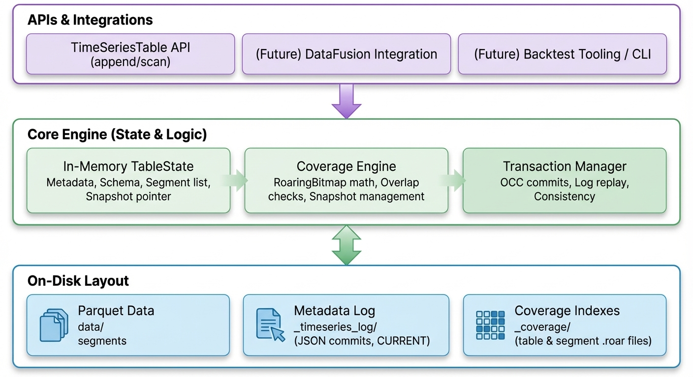

# timeseries-table-format

[](https://www.rust-lang.org)

[](https://github.com/mag1cfrog/timeseries-table-format/actions/workflows/ci.yml)

<p align="center">
  
</p>

Time-series data deserves something better than “just more Parquet files.”

`timeseries-table-format` is a Rust-native, log-structured **time-series table format and table abstraction** that treats time as a first-class index, making it easier to run serious backtests and analytics without drowning in ad-hoc Parquet files. At a glance, it gives you:

- A log-structured, **append-only metadata layer** with versioned commits and optimistic concurrency  
  (inspired by modern open table formats like **Delta Lake** and **Apache Iceberg**),
- A `TimeSeriesTable` abstraction over Parquet segments (not just file paths),
- **RoaringBitmap-based coverage indexes** for overlap detection, gaps, coverage ratios, and “fully covered” windows,
- A clean foundation for integration with engines like DataFusion and backtesting tools.

The core crate, `timeseries-table-core`, implements these pieces and is intended to be reused by higher-level crates.

---

## Motivation & origin

This project started as a refactoring of a personal `stock_trading_bot` repo. See the original experiments in [`stock_trading_bot`](https://github.com/mag1cfrog/stock_trading_bot).

While experimenting with backtests and custom indicators (moving averages, volatility features, etc.), it became clear that the useful part was not "the bot" itself, but the **storage layer**:

- Append-only time-series data (bars, features) that need to stay aligned,
- Fast answers to "where are the gaps?" and "do I have enough history for this strategy?",
- A format that feels closer to **open table formats** (Delta/Iceberg/Hudi) than to one-off CSV/Parquet dumps.

`timeseries-table-format` is an attempt to extract that core into a reusable, well-structured Rust library that also works as a strong data-engineering portfolio piece.

---

## High-level architecture

<p align="center">
  
</p>

At a high level, a time-series table in this project looks like:

- **Parquet segments on disk**  
  - Each segment holds a chunk of time-sorted data (for example, 1h bars for a symbol).
- **Append-only metadata log (`log/`)**  
  - JSON commit files (`0000000000.json`, `0000000001.json`, ...) record actions:
    - adding/removing segments,
    - updating table metadata.
  - A `CURRENT` pointer tracks the latest committed version.
  - Commits use **version-guard OCC**:
    - read current version `N`,
    - attempt commit with `expected_version = N`,
    - only succeed if `CURRENT` is still `N`.
- **Table metadata with a time index**  
  - `TableMeta` carries:
    - `TableKind::TimeSeries(TimeIndexSpec)` (timestamp column, entity/symbol columns, bucket granularity),
    - schema info and created_at.
- **Coverage bitmaps**  
  - Segment- and table-level RoaringBitmap snapshots track which time buckets are present,
  - enable fast append overlap checks and gap/coverage queries without rescanning Parquet.
- **Integration layers (planned)**  
  - DataFusion `TableProvider` for SQL and analytical queries,
  - Backtest tooling that asks for "last N fully-covered bars" or specific coverage constraints.

In v0.1 the focus is on:

- the **core log and metadata model**,
- a minimal `TimeSeriesTable` abstraction,
- coverage snapshot sidecars, overlap-safe append rules, and basic read-side gap/coverage helpers.

---

## Repository layout

Planned structure (early v0.1):

```text
timeseries-table-format/
  Cargo.toml            # workspace
  LICENSE
  README.md
  crates/
    timeseries-table-core/
      Cargo.toml
      src/
        lib.rs
        log.rs
        table.rs
        coverage.rs
        fs.rs
  .github/
    workflows/
      ci.yml            # fmt + clippy + nextest
```

- `crates/timeseries-table-core`  
  Core engine: metadata log, optimistic concurrency, table metadata, coverage utilities.

Future crates (not in v0.1 yet) might include:

- DataFusion integration (e.g. `timeseries-table-datafusion`),
- A small CLI or backtest driver,
- Example projects that consume the format.

---

## Status

Early **MVP** work in progress:

- [x] Workspace + core crate scaffolding  
- [x] Log-based metadata layer with version-guard OCC  
- [x] Time-series table abstraction + basic range scans  
- [x] Coverage snapshots, overlap-safe append checks, and basic gap/coverage metrics  
- [ ] Small end-to-end example (synthetic time-series data)

APIs and on-disk layouts may change until v0.1 is tagged.
