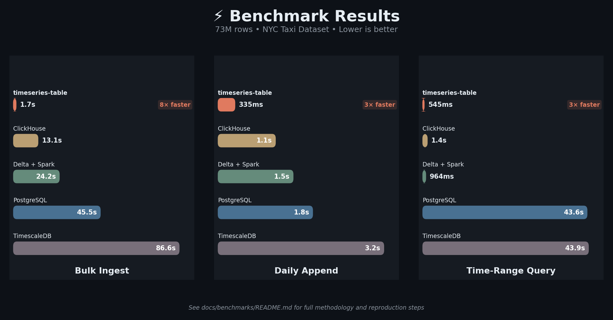

# timeseries-table-format

[](https://crates.io/crates/timeseries-table-format)
[](https://docs.rs/timeseries-table-format)
[](https://pypi.org/project/timeseries-table-format/)
[](https://github.com/mag1cfrog/timeseries-table-format/actions/workflows/ci.yml)


<p align="center">
  
</p>

<h3 align="center">
  <strong>Stop managing Parquet files. Start managing time-series tables.</strong>
</h3>

<p align="center">
  A Rust-native table format with coverage tracking, overlap-safe ingestion,<br/>
  and DataFusion SQL for local time-series data.
</p>

<p align="center">
  <a href="https://mag1cfrog.github.io/timeseries-table-format/"><strong>Documentation</strong></a>
  | <a href="https://pypi.org/project/timeseries-table-format/">Python</a>
  | <a href="https://crates.io/crates/timeseries-table-format">Rust</a>
</p>

> **Early MVP:** APIs and on-disk layouts may change before v1.0.

## Built for time-series data

`timeseries-table-format` turns Arrow data into managed, append-only tables.
It tracks which chronological windows exist for each
entity, rejects overlapping appends, and exposes the result through DataFusion
SQL.

Use a Timestamp, Int64, or UInt64 column as the ordered index. The table format
handles metadata, transactions, coverage, and segment discovery. Index
granularity defines logical intervals, and each complete entity identity may
have at most one row per interval, both within and across appends.

| Need | Built-in support |
|---|---|
| Know whether a time range is covered | Coverage indexes and gap queries |
| Enforce one row per identity and interval | Validation within and across appends |
| Query many Parquet segments | DataFusion SQL with segment pruning |
| Run without Spark or a database server | Rust core, Python package, and CLI |

It is a good fit for market data, sensor pipelines, backtesting systems, and
other incremental time-series workloads that live on a local filesystem.

## A taste of the Python API

```bash
pip install timeseries-table-format
```

```python
import pyarrow as pa
import pyarrow.parquet as pq
import timeseries_table_format as ttf

table = ttf.TimeSeriesTable.create(
    table_root="prices",
    index_column="ts",
    index_type="timestamp",
    index_granularity="1h",
    entity_columns=["symbol"],
)
parquet_file = pq.ParquetFile("prices.parquet")
version = table.append(
    pa.RecordBatchReader.from_batches(
        parquet_file.schema_arrow,
        parquet_file.iter_batches(),
    )
)

session = ttf.Session()
session.register_tstable("prices", "prices")
result = session.sql("SELECT * FROM prices ORDER BY ts")
```

The [Python documentation](https://mag1cfrog.github.io/timeseries-table-format/)
walks through installation, ingestion, and queries.

## Performance

In the repository's 73 million row NYC taxi benchmark, bulk ingestion was
7.7x faster than ClickHouse and 27x faster than PostgreSQL on the tested
hardware and configuration.

<p align="center">
  <picture>
    <source media="(prefers-color-scheme: dark)" srcset="docs/assets/benchmark-chart.png">
    <source media="(prefers-color-scheme: light)" srcset="docs/assets/benchmark-chart-light.png">
    
  </picture>
</p>

See the [benchmark methodology and results](docs/benchmarks/README.md) for the
workloads, environment, and full comparison.

## Interfaces

| Interface | Where to start |
|---|---|
| Python | [Python documentation](https://mag1cfrog.github.io/timeseries-table-format/) and [PyPI](https://pypi.org/project/timeseries-table-format/) |
| Rust | [Engine guide](crates/timeseries-table-format/ENGINE.md) and [docs.rs](https://docs.rs/timeseries-table-format) |
| CLI | [CLI reference](crates/timeseries-table-format/CLI.md) |
| DataFusion | [Integration guide](crates/timeseries-table-format/DATAFUSION.md) |

## Current scope

The current release focuses on local, append-only tables. It does not yet
support object storage, compaction, schema evolution, row updates, merges, or
time-travel queries.

For design details, read [How I built this](docs/blog/how-i-built-this/how-i-built-this.md)
or view the [architecture diagram](docs/assets/high-level-architecture.png).

## Contributing

Contributions and bug reports are welcome. See the repository's existing
issues and development documentation before starting a larger change.

## License

MIT. See [LICENSE](LICENSE).
