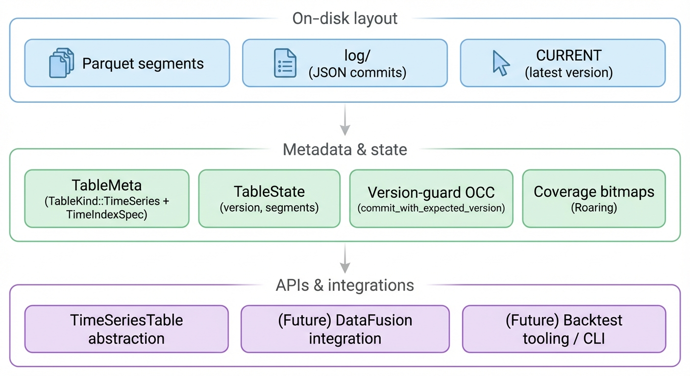

# timeseries-table-format

[](https://www.rust-lang.org)
[](https://crates.io/crates/timeseries-table-format)
[](https://docs.rs/timeseries-table-format)
[](https://pypi.org/project/timeseries-table-format/)
[](https://pypi.org/project/timeseries-table-format/)

[](https://github.com/mag1cfrog/timeseries-table-format/actions/workflows/ci.yml)

<p align="center">
  
</p>

<h3 align="center">
  <strong>Stop managing Parquet files. Start managing time-series tables.</strong>
</h3>

<p align="center">
  A Rust-native table format that brings Delta Lake/Iceberg-style transactions<br/>
  to time-series data—with built-in coverage tracking for gaps and overlaps.
</p>

<p align="center">
  Built in Rust. Python bindings available on PyPI.
</p>

> **Early MVP:** APIs and on-disk layouts may change before v1.0.

---

## Why This Exists

Delta Lake and Apache Iceberg are great for general-purpose analytics. But if you're working with **time-series specifically**, a few problems come up repeatedly—coverage ("do I have data for this range?"), gaps ("where are the missing windows?"), and overlap-safe ingestion ("did I already ingest this time window?"). This project bakes those time-series primitives into the table format.

| Problem | Delta/Iceberg | This Project |
|---------|---------------|--------------|
| "Do I have data for 2024-01-15 to 2024-03-20?" | Scan metadata or query | coverage_ratio_for_range(...) → instant |
| "Where are the gaps in my dataset?" | Write custom logic | max_gap_len_for_range(...) → built-in |
| "Will this append overlap existing data?" | Hope for the best | Automatic overlap detection |
| Deployment complexity | JVM/Spark ecosystem | Single Rust binary |

**This project is ideal for:**
- Backtesting systems that need gap-aware data loading
- Sensor/IoT data pipelines with strict coverage requirements
- Financial data stores where overlap = disaster
- Learning how modern table formats work (well-documented internals!)

---

## Key Features

| | |
|---|---|
| **ACID-like transactions** | Append-only commit log with optimistic concurrency control—no more corrupted datasets from failed writes |
| **Chronological layout** | One ascending Timestamp, Int64, or UInt64 index with configurable bucket granularity |
| **Coverage tracking** | RoaringBitmap indexes answer "where are my gaps?" in milliseconds, not minutes |
| **Overlap-safe appends** | Automatic detection prevents accidental duplicate data ingestion |
| **DataFusion integration** | SQL queries with ordered-index segment pruning out of the box |
| **Rust core + Python bindings** | Rust-first core (CLI + libraries) with Python bindings for local workflows |
| **Fast ingest** | [7–27× faster](#performance-benchmarks) than ClickHouse/PostgreSQL on bulk loads and daily appends |

---

## Install (Python)

```bash
pip install timeseries-table-format
```

Python docs: https://mag1cfrog.github.io/timeseries-table-format/

---

## Python Quickstart

**TL;DR:** `Session.sql(...)` returns a `pyarrow.Table`:

```python
import timeseries_table_format as ttf

out = ttf.Session().sql("select 1 as x")
print(type(out))  # pyarrow.Table
```

Convert to Polars: `import polars as pl; pl.from_arrow(out)`

More examples:
- `crates/timeseries-table-python/examples/quickstart_create_append_query.py`
- `crates/timeseries-table-python/examples/register_and_join_two_tables.py`

<details>
<summary><strong>End-to-end example (create → append → register 2 tables → join)</strong></summary>

```python
from __future__ import annotations

import tempfile
from pathlib import Path

import pyarrow as pa
import pyarrow.parquet as pq

import timeseries_table_format as ttf


def _write_parquet_prices(path: Path) -> None:
    pq.write_table(
        pa.table(
            {
                "ts": pa.array([0, 3_600 * 1_000_000], type=pa.timestamp("us")),
                "symbol": pa.array(["NVDA", "NVDA"], type=pa.string()),
                "close": pa.array([1.0, 2.0], type=pa.float64()),
            }
        ),
        str(path),
    )


def _write_parquet_volumes(path: Path) -> None:
    pq.write_table(
        pa.table(
            {
                "ts": pa.array([0, 3_600 * 1_000_000], type=pa.timestamp("us")),
                "symbol": pa.array(["NVDA", "NVDA"], type=pa.string()),
                "volume": pa.array([10, 20], type=pa.int64()),
            }
        ),
        str(path),
    )


with tempfile.TemporaryDirectory() as d:
    base_dir = Path(d)

    prices_root = base_dir / "prices_tbl"
    prices = ttf.TimeSeriesTable.create(
        table_root=str(prices_root),
        index_column="ts",
        index_type="timestamp",
        bucket="1h",
        entity_columns=["symbol"],
        timezone=None,
    )
    prices_seg = base_dir / "prices.parquet"
    _write_parquet_prices(prices_seg)
    prices.append_parquet(str(prices_seg))

    volumes_root = base_dir / "volumes_tbl"
    volumes = ttf.TimeSeriesTable.create(
        table_root=str(volumes_root),
        index_column="ts",
        index_type="timestamp",
        bucket="1h",
        entity_columns=["symbol"],
        timezone=None,
    )
    volumes_seg = base_dir / "volumes.parquet"
    _write_parquet_volumes(volumes_seg)
    volumes.append_parquet(str(volumes_seg))

    sess = ttf.Session()
    sess.register_tstable("prices", str(prices_root))
    sess.register_tstable("volumes", str(volumes_root))

    out = sess.sql(
        """
        select p.ts as ts, p.symbol as symbol, p.close as close, v.volume as volume
        from prices p
        join volumes v
        on p.ts = v.ts and p.symbol = v.symbol
        order by p.ts
        """
    )
    print(type(out))  # pyarrow.Table
    print(out)
```

</details>

### Integer chronological indexes

Int64 and UInt64 use application-defined units. Cast SQL literals above `i64::MAX` as `BIGINT UNSIGNED`.

```python
import timeseries_table_format as ttf

signed = ttf.TimeSeriesTable.create(
    table_root="signed_ticks",
    index_column="tick",
    index_type="int64",
    bucket_width=10,
)
signed.append_parquet("signed.parquet")  # tick must be Arrow int64

unsigned = ttf.TimeSeriesTable.create(
    table_root="unsigned_counters",
    index_column="counter",
    index_type="uint64",
    bucket_width=100,
)
unsigned.append_parquet("unsigned.parquet")  # counter must be Arrow uint64
assert unsigned.index_spec() == {
    "column": "counter",
    "entity_columns": [],
    "kind": "uint64",
    "bucket_width": 100,
}

session = ttf.Session()
session.register_tstable("signed_ticks", "signed_ticks")
session.register_tstable("unsigned_counters", "unsigned_counters")
negative = session.sql(
    "SELECT tick FROM signed_ticks WHERE tick >= -20 AND tick < 0 ORDER BY tick"
)
large = session.sql(
    "SELECT counter FROM unsigned_counters "
    "WHERE counter >= CAST('9223372036854775808' AS BIGINT UNSIGNED) "
    "ORDER BY counter"
)
```

---

## Core Concepts

Every table has one ascending chronological index. It can be a physical Timestamp or an integer-valued logical clock, with units defined by the application. The public APIs and metadata call this the ordered index.

| Index domain | Required Parquet/Arrow type | Bucket configuration |
|--------------|-----------------------------|----------------------|
| Timestamp | `timestamp` with an explicit unit | A time duration such as `1m` or `1h` |
| Int64 | Signed `int64` | A positive width in index-value units |
| UInt64 | Unsigned `uint64` | A positive width in index-value units |

The configured type must match the Parquet column exactly. The library does not infer timestamps from integers or convert between signed and unsigned values.

### Buckets, ranges, and coverage

Buckets drive coverage and overlap checks; they do not resample data.

- For Timestamp indexes, `bucket=1h` groups values into one-hour buckets.
- For integer indexes, `bucket_width=10` groups values in application-defined units.
- Int64 uses Euclidean division. With width 10, `-11` belongs to `[-20, -10)` and `-1` belongs to `[-10, 0)`.
- Core range operations use half-open intervals: the start is included and the end is excluded, written `[start, end)`.
- Coverage records bucket-level evidence. A covered bucket means at least one segment contributes data to it, not that every possible index value is present.

Choose a bucket at the granularity expected to be unique per entity; overlapping segments in the same entity bucket are rejected.

### Current index limitations

Indexes cannot currently use floats, decimals, strings, multiple columns, descending order, or implicit signedness conversion.

### Migrating timestamp-only callers

This release makes a clean source-breaking transition with no compatibility aliases.

| Previous API | Current API |
|--------------|-------------|
| CLI create `--time-column ts` | `--index-column ts --index-type timestamp` |
| CLI append `--time-column ts` | Remove the option; append uses the persisted index specification |
| Python create `time_column="ts"` | `index_column="ts", index_type="timestamp"` |
| Python append `time_column="ts"` | Remove the argument; append uses the persisted index specification |
| Python `index_spec()["timestamp_column"]` | `index_spec()["column"]`; inspect `kind` for the domain |

---

## Walkthrough: NVDA 1h + MA(5)

Fastest way to see the format end-to-end (no external services needed):

1) Ingest sample data (creates `examples/nvda_table/`):

```bash
cargo run -p timeseries-table-format --example ingest_nvda
```

2) Query with DataFusion + moving average window:

```bash
cargo run -p timeseries-table-format --features datafusion --example query_nvda_ma
```

Example output:

```
+---------------------+--------+------------+
| ts                  | close  | ma_5       |
+---------------------+--------+------------+
| 2024-06-01T00:00:00 | 115.22 | 115.22     |
| 2024-06-01T01:00:00 | 115.55 | 115.385    |
| 2024-06-01T02:00:00 | 115.51 | 115.426667 |
| 2024-06-01T03:00:00 | 114.99 | 115.3175   |
| 2024-06-01T04:00:00 | 114.7  | 115.194    |
+---------------------+--------+------------+
```

Sample data lives at `crates/timeseries-table-format/examples/assets/nvda_1h_sample.csv` (240 rows of NVDA 1h bars). The ingestion step writes a Parquet segment and appends it via the transaction log using optimistic concurrency.

---

## Other Interfaces

Python users: see [Install (Python)](#install-python) and [Python Quickstart](#python-quickstart) above.

### Command-Line Interface (CLI)

```bash
# Install
cargo install timeseries-table-format --features cli

# Timestamp
tstable create --table ./events --index-column ts --index-type timestamp --bucket 1h
tstable append --table ./events --parquet ./events.parquet
tstable query --table ./events \
  --sql "SELECT * FROM events WHERE ts >= TIMESTAMP '2026-01-01 00:00:00' ORDER BY ts"

# Signed logical time
tstable create --table ./signed_ticks --index-column tick --index-type int64 --bucket-width 10
tstable append --table ./signed_ticks --parquet ./signed.parquet
tstable query --table ./signed_ticks \
  --sql "SELECT * FROM signed_ticks WHERE tick >= -20 AND tick < 0 ORDER BY tick"

# Unsigned logical time above i64::MAX
tstable create --table ./unsigned_counters --index-column counter --index-type uint64 --bucket-width 100
tstable append --table ./unsigned_counters --parquet ./unsigned.parquet
tstable query --table ./unsigned_counters \
  --sql "SELECT * FROM unsigned_counters WHERE counter >= CAST('9223372036854775808' AS BIGINT UNSIGNED) ORDER BY counter"
```

Run `tstable shell` without `--table` for guided creation; it prompts only for options relevant to the selected index type.

See the [CLI documentation](crates/timeseries-table-format/CLI.md) for the full command reference.

### Rust API

```bash
cargo add timeseries-table-format
```

```toml
[dependencies]
timeseries-table-format = "0.1"
tokio = { version = "1", features = ["macros", "rt-multi-thread"] }
chrono = "0.4"
```

```rust
use chrono::{TimeZone, Utc};
use timeseries_table_format::{TableError, TableLocation, TimeSeriesTable};

#[tokio::main]
async fn main() -> Result<(), TableError> {
    let table = TimeSeriesTable::open(TableLocation::local("./my_table")).await?;

    let start = Utc.timestamp_opt(0, 0).single().unwrap();
    let end = Utc.timestamp_opt(120, 0).single().unwrap();

    let ratio = table.coverage_ratio_for_range(start, end).await?;
    println!("Coverage ratio: {:.1}%", ratio * 100.0);

    Ok(())
}
```


See the [Rust engine guide](crates/timeseries-table-format/ENGINE.md) for full API details.

### DataFusion Integration

```toml
[dependencies]
timeseries-table-format = "0.1"
```

See the [DataFusion integration guide](crates/timeseries-table-format/DATAFUSION.md) for SQL query examples.

---

## Performance Benchmarks

Benchmarked on **73M rows** of NYC taxi data (bulk load + 90 days of daily appends):

<p align="center">
  <picture>
    <source media="(prefers-color-scheme: dark)" srcset="docs/assets/benchmark-chart.png">
    <source media="(prefers-color-scheme: light)" srcset="docs/assets/benchmark-chart-light.png">
    
  </picture>
</p>

<table>
<tr><td>

| vs ClickHouse | Speedup |
|---------------|---------|
| Bulk ingest | **7.7×** |
| Daily append | **3.3×** |
| Time-range scan | **2.5×** |

</td><td>

| vs PostgreSQL | Speedup |
|---------------|---------|
| Bulk ingest | **27×** |
| Daily append | **5.5×** |
| Time-range scan | **80×** |

</td></tr>
</table>

<sub>Aggregation queries (GROUP BY, filtering) are competitive with ClickHouse. Delta + Spark Q1 is now 964ms with partitioned Delta. See [full benchmark methodology and results](docs/benchmarks/README.md).</sub>

---

## Architecture

<p align="center">
  
</p>

<details>
<summary><strong>Click to expand architecture details</strong></summary>

A time-series table consists of:

- **Parquet segments on disk**  
  Each segment holds data addressed by the table's chronological index.

- **Append-only metadata log (`_timeseries_log/`)**  
  - JSON commit files (`0000000001.json`, `0000000002.json`, ...) record segment additions/removals
  - `CURRENT` pointer tracks the latest committed version
  - **Version-guard OCC**: read version N → commit with expected_version=N → succeed only if CURRENT is still N

- **Table metadata with ordered index**
  - `IndexSpec` with one Timestamp, Int64, or UInt64 column, entity columns, and bucket granularity
  - Schema info and creation timestamp

- **Coverage bitmaps (`_coverage/`)**  
  - Segment- and table-level RoaringBitmap snapshots
  - Enable O(1) overlap checks and gap queries without rescanning Parquet

</details>

---

## Project Status

Current status and near-term roadmap:

- [x] Log-based metadata layer with version-guard OCC  
- [x] Time-series table abstraction + range scans  
- [x] Coverage snapshots + overlap-safe appends  
- [x] CLI for table management and SQL queries
- [x] DataFusion `TableProvider` integration
- [x] End-to-end example with sample data
- [ ] Compaction / segment merging
- [ ] Time-travel queries

---

## Further Reading

- [How I built this: design decisions, coverage tracking, and benchmark walkthrough](docs/blog/how-i-built-this/how-i-built-this.md)
- [Benchmark methodology & results](docs/benchmarks/README.md)
- [Python docs](https://mag1cfrog.github.io/timeseries-table-format/)
- [CLI reference](crates/timeseries-table-format/CLI.md)
- [Rust engine guide](crates/timeseries-table-format/ENGINE.md)
- [DataFusion integration](crates/timeseries-table-format/DATAFUSION.md)

---

## Contributing

Contributions welcome! This project is also a learning exercise in building table formats from scratch—if you're curious about the internals, the code is heavily commented.

---

## License

MIT License — see [LICENSE](LICENSE) for details.
